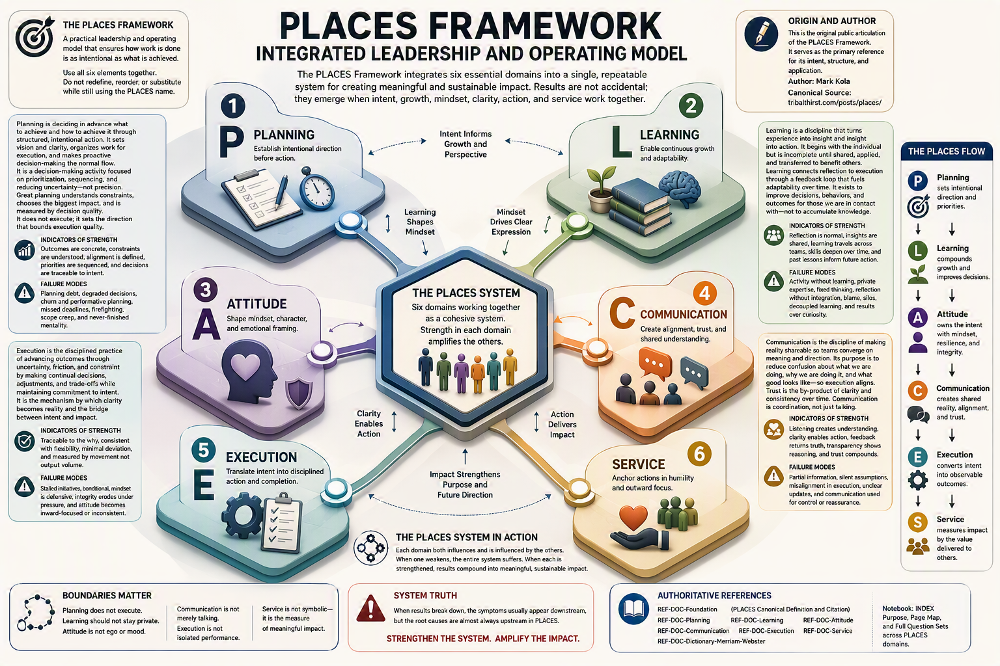

The graphic depicts six domains surrounding a central hexagon labeled "The PLACES System."

Planning (P) establishes intentional direction before action.
Learning (L) enables continuous growth and adaptability.
Attitude (A) shapes mindset, character, and emotional framing.
Communication (C) creates alignment, trust, and shared understanding.
Execution (E) translates intent into disciplined action and completion.
Service (S) anchors actions in humility and outward focus.

Connecting arrows show that each domain strengthens and influences the others. The center asserts that strength in each domain amplifies the effectiveness of the entire system. Side panels provide definitions, indicators of strength, common failure modes, boundaries, and a summary flow showing how planning leads to learning, attitude, communication, execution, and service. The infographic emphasizes that sustainable results come from the integration of all six domains rather than any single element operating independently.